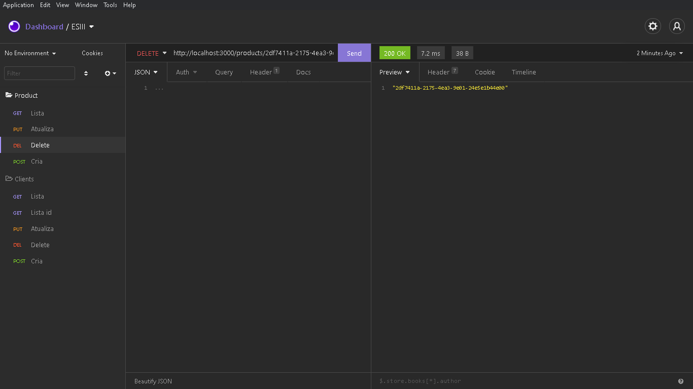
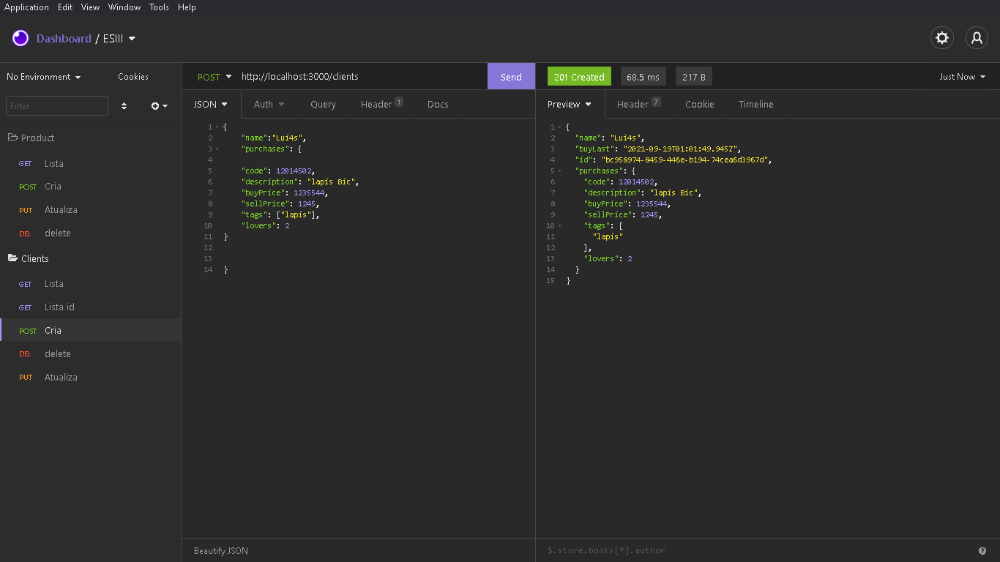
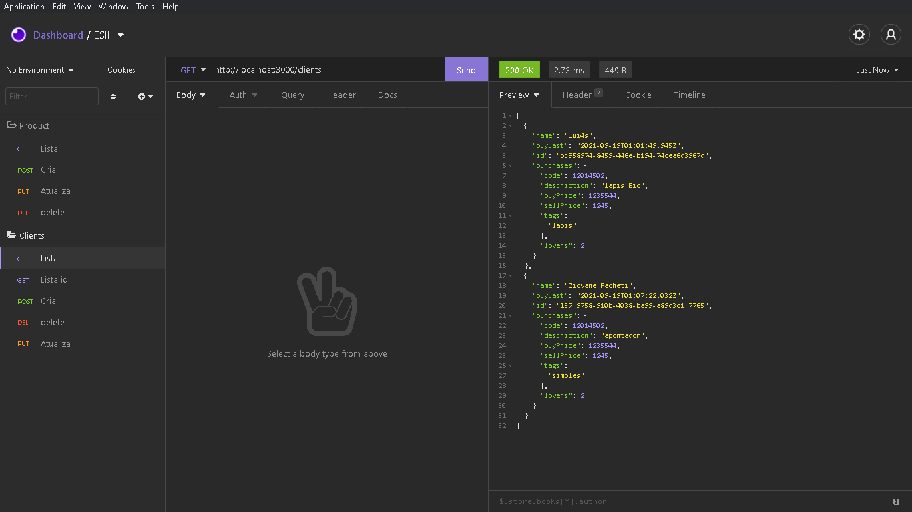
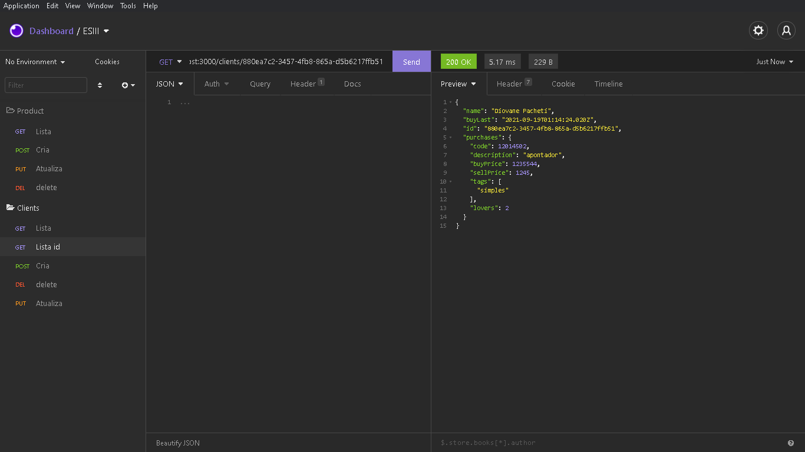
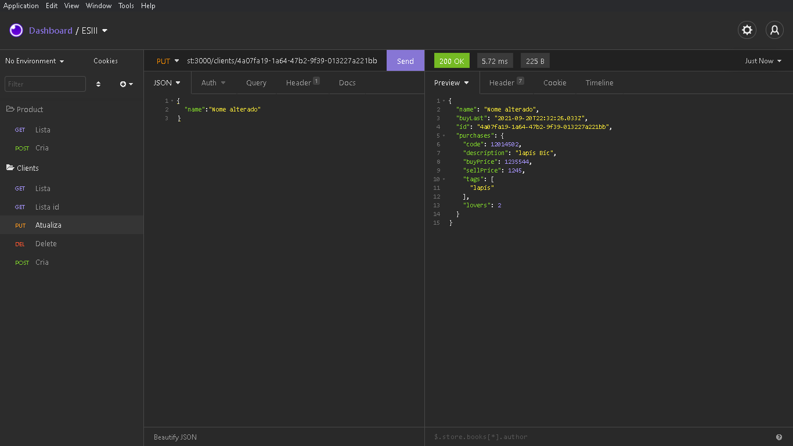
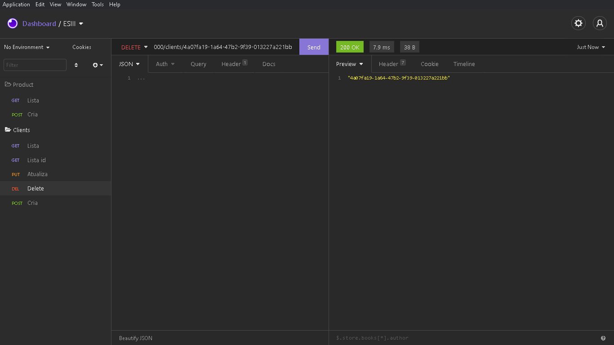
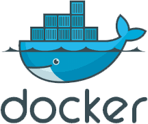
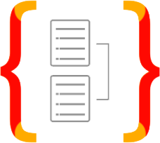

<h1 align="center"> ESIII - TypeScript-Node-e-Express</h1>

<p align="center">
    
    
</p>

## Tecnologias Utilizadas no projeto :construction:

- [Node.js](https://nodejs.org/en/) 
- [typescript](https://www.typescriptlang.org/) 
- [Express](https://expressjs.com/pt-br/)

## Projeto :computer:

Atividade prática

🎬 A partir do código gerado na aula: 

0️⃣ Aplique pontos de melhoria;

1️⃣ 'Complete' o desenvolvimento do código de aula forma criativa;

2️⃣ Crie mais uma entidade e sua devida representação nas camadas da aplicação;

☠️ Identifique claramente nos commits o que foi desenvolvimento adicionalmente.

💡No ato da leitura do exercício o repositório que conterá a solução já deverá ser criado e o seu link público 

adicionado a resposta neste formulário. Na aula do dia 14/9 os alunos irão discutir suas 

## Como executar :gear:

- Clone o repositório `https://github.com/DioenDJS/ESIII---TypeScript-Node-e-Express-.git`.
- Install as dependências com o comando `npm install`.
- Rode o `npm run dev` para iniciar a aplicação.
Ao final a aplicação estará disponível em `http://localhost:3000`.


## Insomnia

[](https://insomnia.rest/run/?label=ESIII&uri=https%3A%2F%2Fraw.githubusercontent.com%2FDioenDJS%2FESIII---TypeScript-Node-e-Express-%2Fmain%2Fassets%2FInsomnia_2021-09-18.json)
## Criação Product


## Lista Product


## Delete Product



## Criação Client



## Lista Clients



## Lista Client id



## Atualiza Client 



## Delete Client


## Dependências do Projetos :card_index_dividers:

> - Typescript
>
> ```npm install typescript -D```

> - express
>
> ```npm install express```

> - uuidv4s
>
>```npm install uuidv4```

> - ts-node-dev 
>
>```npm i ts-node-dev -D```

# Docker: 

> como foi instalado e configurado o ``docker`` neste projeto

- [Notion](https://www.notion.so/Docker-2e9af245cb3f4cdda13adbb027311ace) 


# TYPEORM: 

> como foi instalado e configurado o ``TYPEORM`` neste projeto

- [Notion](https://www.notion.so/TYPEORM-3be2ed36d855431db3ba43a6c0a35848) 